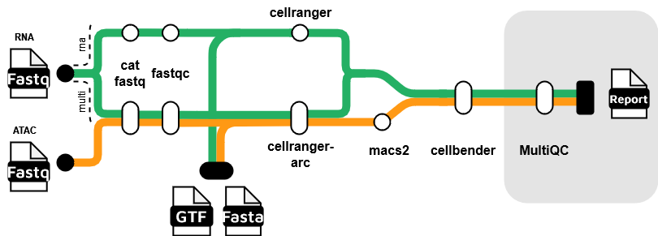

## Introduction

Snomics is a Nextflow pipeline designed for the pre-processing of 10x scRNAseq and multiome data. It is built on the nf-core framework,designed to be scalable and reproducible.

Snomics is primarily built on top of 10x's cellranger and cellranger arc tools, aiming to abstract and speed up processing by only requiring simple inputs and parallelising much of the work across a HPC environment. It also includes additional steps to ensure up-to-date best practices are followed. Using both cellranger and cellranger arc, Snomics can process scRNAseq and multiome data in a single pipeline allowing uniform processing of both data types.

The pipeline includes the following steps:

1. **Concatenation of fastq files**
2. **Quality control - FastQC**
3. **Alignment and quantification - Cellranger or Cellranger Arc**
4. **Peak calling - MACS2**
5. **Removal of expression artifacts - CellBender**
6. **Reporting** *[Not yet implemented]* **- MultiQC, Custom reports**

## Installation

To install Snomics, clone the repository and navigate to the project directory or if a member of the ukdrmultiomicsproject project the required files are already available in ukdrmultiomicsproject/.

```bash
git clone -b dev https://github.com/nfancy/nf-core-snomics.git
cd nf-core-snomics
```

## Usage

Usage of the pipeline aims to be as simple as possible. It requires two essenstial steps:

- **Input data**
- **Set parameters**

### Input

The primary input to the pipeline is a CSV file containing a list of sample names and the location of the fastq files for each of them. It requires the following layout

```csv
sample,fastq_1,fastq_2
sample1,/lane1/path/to/sample1_R1.fastq.gz,/lane1/path/to/sample1_R2.fastq.gz
sample1,/lane2/path/to/sample2_R1.fastq.gz,/lane2/path/to/sample2_R2.fastq.gz
sample2,/lane1/path/to/sample3_R1.fastq.gz,/lane1/path/to/sample3_R2.fastq.gz
...
```

Matching sample names will be used to group and concatenate fastq files allowing for multiple lanes to be processed together.

### Parameters

The pipeline requires a number of parameters to be set. These can be set using a config file or passed as command line arguments. The most important parameters are:

- `--input` - The path to the input CSV file
- `--outdir` - The path to the output directory
- `--aligner` - The aligner to use (cellranger or cellranger_arc)
- `-profile` - The profile to use (e.g. singularity, docker)

To use a config file, create a file with the required parameters (nextflow.config can be used as a template) and pass it to the pipeline using the `-c` flag. In addition to this Imperial HPC users can use the `conf/imperial.config` file to run with settings specific to the HPC. 

### Example script

Here is an example script, a template is available in the repository.

```bash
#!/bin/bash
#PBS -l walltime=08:00:00
#PBS -l select=1:ncpus=2:mem=8gb

cd $PBS_O_WORKDIR
export JAVA_HOME=/bin/jdk-17
export PATH=/bin/jdk-17/bin:$PATH

mkdir -p outdir

nextflow run ~/Packages/snomics/snomics_dev/nf-core-snomics/main.nf \
--input "samplesheet.csv" \
--outdir "outdir" \
--aligner cellranger_arc \
-profile singularity \
-c conf/imperial.config \
-c conf/run_param.config
```

### Output

The pipeline generates outputs from each main stage of the pipeline. By defualt these are the outputs from fastQC, cellranger/cellranger-arc, cellbender and MACS2.

The main outputs are:

- FastQC reports (sample_name_fastqc.html)
- cellranger/cellranger-arc count matricies (raw_feature_bc_matrix.h5) and fragments (atac_fragments.tsv.gz)
- cellbender corrected expression matrix (sample_name.h5)
- MAC2 peak calls (sample_name_peaks.narrowPeak)


## Support

For any issues or questions, please refer to the [GitHub repository](https://github.com/nfancy/nf-core-snomics) or contact the authors.
